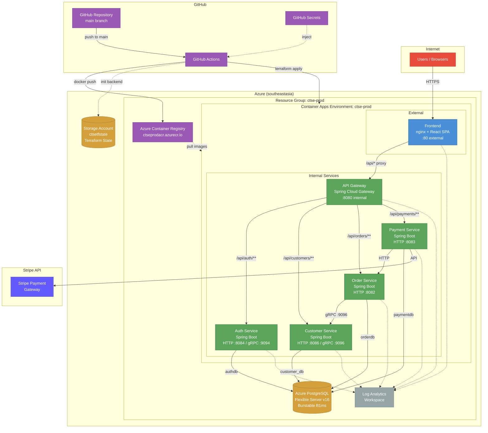
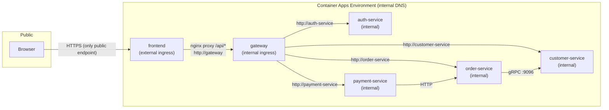

# Deployment Architecture

```mermaid
graph TB
    subgraph Internet
        USER[Users / Browsers]
    end

    subgraph GitHub
        REPO[GitHub Repository<br/>main branch]
        GHA[GitHub Actions]
        SECRETS[GitHub Secrets]
    end

    subgraph Azure["Azure (southeastasia)"]

        subgraph RG["Resource Group: ctse-prod"]

            ACR[Azure Container Registry<br/>ctseprodacr.azurecr.io]

            subgraph CAE["Container Apps Environment: ctse-prod"]

                subgraph External
                    FRONTEND[Frontend<br/>nginx + React SPA<br/>:80 external]
                end

                subgraph Internal["Internal Services"]
                    GATEWAY[API Gateway<br/>Spring Cloud Gateway<br/>:8080 internal]

                    AUTH[Auth Service<br/>Spring Boot<br/>HTTP :8084 / gRPC :9094]
                    CUSTOMER[Customer Service<br/>Spring Boot<br/>HTTP :8086 / gRPC :9096]
                    ORDER[Order Service<br/>Spring Boot<br/>HTTP :8082]
                    PAYMENT[Payment Service<br/>Spring Boot<br/>HTTP :8083]
                end
            end

            PG[(Azure PostgreSQL<br/>Flexible Server v16<br/>Burstable B1ms)]
            LOGS[Log Analytics<br/>Workspace]
        end

        TF_STATE[(Storage Account<br/>ctsetfstate<br/>Terraform State)]
    end

    subgraph Stripe["Stripe API"]
        STRIPE[Stripe Payment<br/>Gateway]
    end

    %% User traffic flow
    USER -->|HTTPS| FRONTEND
    FRONTEND -->|/api/* proxy| GATEWAY

    %% Gateway routing
    GATEWAY -->|/api/auth/**| AUTH
    GATEWAY -->|/api/customers/**| CUSTOMER
    GATEWAY -->|/api/orders/**| ORDER
    GATEWAY -->|/api/payments/**| PAYMENT

    %% Inter-service communication
    ORDER -->|gRPC :9096| CUSTOMER
    PAYMENT -->|HTTP| ORDER

    %% Database connections
    AUTH -->|authdb| PG
    CUSTOMER -->|customer_db| PG
    ORDER -->|orderdb| PG
    PAYMENT -->|paymentdb| PG

    %% External integrations
    PAYMENT -->|API| STRIPE

    %% CI/CD flow
    REPO -->|push to main| GHA
    SECRETS -.->|inject| GHA
    GHA -->|docker push| ACR
    GHA -->|terraform apply| CAE
    GHA -.->|init backend| TF_STATE
    ACR -.->|pull images| CAE

    %% Logging
    AUTH -.-> LOGS
    CUSTOMER -.-> LOGS
    ORDER -.-> LOGS
    PAYMENT -.-> LOGS
    GATEWAY -.-> LOGS
    FRONTEND -.-> LOGS

    %% Styling
    classDef external fill:#4a90d9,stroke:#2c5f8a,color:#fff
    classDef internal fill:#5ba55b,stroke:#3d7a3d,color:#fff
    classDef database fill:#d4a03c,stroke:#a67c2e,color:#fff
    classDef cicd fill:#9b59b6,stroke:#7d3c98,color:#fff
    classDef stripe fill:#635bff,stroke:#4b44c0,color:#fff
    classDef user fill:#e74c3c,stroke:#c0392b,color:#fff
    classDef logging fill:#95a5a6,stroke:#7f8c8d,color:#fff

    class FRONTEND external
    class GATEWAY,AUTH,CUSTOMER,ORDER,PAYMENT internal
    class PG,TF_STATE database
    class REPO,GHA,SECRETS,ACR cicd
    class STRIPE stripe
    class USER user
    class LOGS logging
```

## CI/CD Pipeline Flow

```mermaid
graph LR
    subgraph Trigger
        PUSH[Push to main<br/>or PR merge]
    end

    subgraph GHA["GitHub Actions (automatic)"]
        CHECKOUT1[Checkout] --> LOGIN1[Login to ACR<br/>admin creds]
        LOGIN1 --> BUILDX[Setup Buildx]
        BUILDX --> BUILD_BE[Build Backend<br/>Images x5]
        BUILD_BE --> BUILD_FE[Build Frontend<br/>Image]
        BUILD_FE --> PUSH_ACR[Push to ACR<br/>tag: commit SHA]
    end

    subgraph Local["Local Machine (manual)"]
        AZ_LOGIN[az login] --> TF_INIT[terraform init]
        TF_INIT --> TF_PLAN[terraform plan]
        TF_PLAN --> TF_APPLY[terraform apply]
    end

    PUSH --> CHECKOUT1
    PUSH_ACR -.->|"run deploy.sh<br/>with commit SHA"| AZ_LOGIN

    classDef trigger fill:#e74c3c,stroke:#c0392b,color:#fff
    classDef build fill:#4a90d9,stroke:#2c5f8a,color:#fff
    classDef deploy fill:#5ba55b,stroke:#3d7a3d,color:#fff

    class PUSH trigger
    class CHECKOUT1,LOGIN1,BUILDX,BUILD_BE,BUILD_FE,PUSH_ACR build
    class AZ_LOGIN,TF_INIT,TF_PLAN,TF_APPLY deploy
```

## Network Topology

```mermaid
graph LR
    subgraph Public
        BROWSER[Browser]
    end

    subgraph "Container Apps Environment (internal DNS)"
        FE["frontend<br/>(external ingress)"]
        GW["gateway<br/>(internal ingress)"]
        AS["auth-service<br/>(internal)"]
        CS["customer-service<br/>(internal)"]
        OS["order-service<br/>(internal)"]
        PS["payment-service<br/>(internal)"]
    end

    BROWSER -->|"HTTPS (only public endpoint)"| FE
    FE -->|"nginx proxy /api/*<br/>http://gateway"| GW
    GW -->|"http://auth-service"| AS
    GW -->|"http://customer-service"| CS
    GW -->|"http://order-service"| OS
    GW -->|"http://payment-service"| PS
    OS -->|"gRPC :9096"| CS
    PS -->|"HTTP"| OS
```
